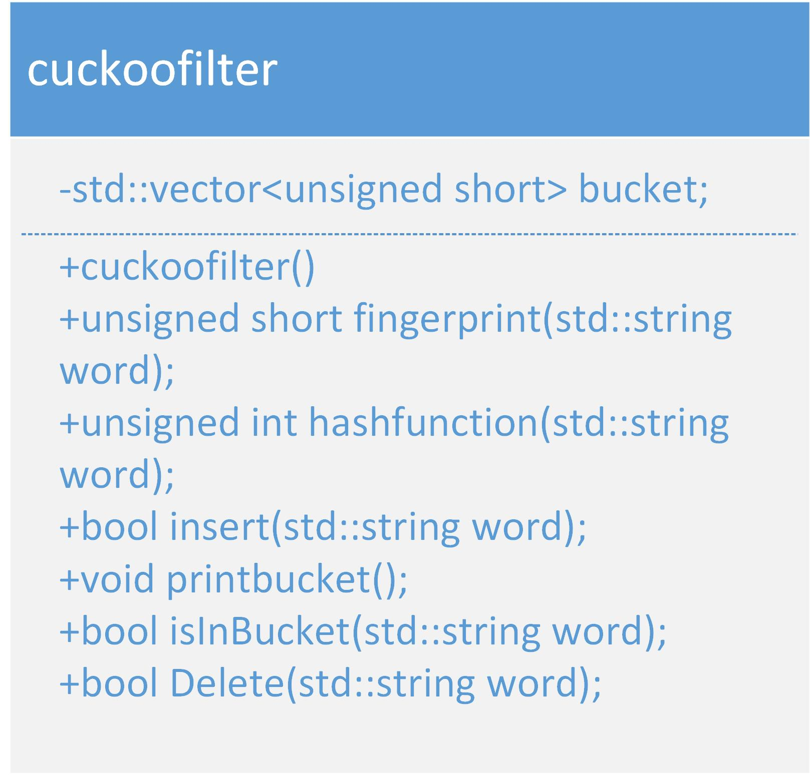

# 第四周学习内容
***
# bloom filter

*(以下内容皆来自于网络)*

**介绍：** Bloom filter是由Howard Bloom在1970年提出的二进制向量数据结构，它具有空间和时间效率，被用来检测一个元素是不是集合中的一个成员。如果检测结果为是，该元素不一定在集合中；但如果检测结果为否，该元素一定不在集合中。

## bloom filter的优点

+ 空间效率和查询时间都远远超过一般的算法，布隆过滤器存储空间和插入 / 查询时间都是常数O(1)
+ 散列函数相互之间没有关系，方便由硬件并行实现
+ 布隆过滤器不需要存储元素本身，在某些对保密要求非常严格的场合有优势

## bloom filter的用途
+ 分布式数据库Bigtable以及Hbase使用了布隆过滤器来查找不存在的行或列，以及减少磁盘查找的IO次数
+ 垃圾邮件地址过滤，记录下那些发送垃圾邮件的email地址
+ Google Chrome浏览器使用了布隆过滤器加速安全浏览服务，Google安全浏览服务向Chrome、Firefox和Safari浏览器以及ISP提供包含恶意软件或钓鱼内容的URL列表，该服务会在用户访问危险网站或下载危险文件之前显示警告。
  

## bloom filter的实现

使用五个经典的字符串hash函数
```
unsigned int RSHash(const char *str);
unsigned int JSHash(const char *str);
unsigned int BKDRHash(const char *str);
unsigned int PJWHash(const char *str);
unsigned int APHash(const char *str);
```

二进制向量使用的是C++标准库bitset，使用bitset需要导入头文件：`#include <bitset>`


将哈希函数装入vector容器中，使用公式k=(m/n)ln(2)计算需要几个哈希函数
`using hashFunc = std::function<unsigned int(const char*)>;`
`std::vector<hashFunc> hashset;`


## bloom filter 测试

10个字符串，bit槽位为70，根据公式k=(m/n)ln(2),需要5个哈希函数，使用以下代码随机生成1000个字符串进行测试
```
        int k=rand()%100+1;//随机生成一个字符串的长度
        string ss="";
        for(int i=0;i<k;i++)
        {
            int s;
            char x;
            s=rand()%2;
            if(s==1)
                x=rand()%('Z'-'A'+1)+'A';
            else
                x=rand()%('z'-'a'+1)+'a';
            ss.push_back(x);
        }
```
测试结果：误判 52/1000
误判率理论计算结果(1-e^(-kn/m))^k=0.034

关于bloom filter增加删除功能，将bitset换成vector，改成计数器即可，具有删除功能的bloom filter和cuckoo filter相比，实现简单，而且空间效率和时间效率好像差别不大。
***
# cuckoo filter

**介绍：** 它既可以确保该元素存在的必然性，又可以在不违背此前提下删除任意元素。
## cuckoo filter 实现关键点

**查找：**
哈希位置计算方法 `i1 = hashfunction(word)`
备用位置计算方法 `i2 = i1 ^hashfunction(to_string(fingerPrint))`
i1和i2与hashfunction(to_string(fingerPrint))作异或运算，都可以得到对方

**数据结构：**
max参数是扩容的上限
`std::vector<std::vector<unsigned short>> matrix(max, std::vector<unsigned short>(BUCKET_SIZE, 65535));`


## cuckoo filter设计与实现



**插入伪代码：**
```
f = fingerprint(x)
i1 = hash(x)
i2 = i1 xor hash(f)
for index=0;index<max;index++;
    if bucket[index][i1] or bucket[index][i2] has an empty entry then
        //只要有空位就先插入空位里
        add f to that bucket
        return Done
i  = randomly pick i1 or i2
    for n=0;n<MaxNumKicks;++n
        swap f and the fingerprint stored in entry e;
        i = i xor hash(f)
        if bucket[bucketnum][i] has an empty entry then
            add f to bucket[i]
            return Done
if bucketnum<MAX
    bucketnum++;//扩容
else
    return false;
for n=0;n<MaxNumKicks;++n//扩容后重新插入
    swap f and the fingerprint stored in entry e;
    i = i xor hash(f)
    if bucket[bucketnum][i] has an empty entry then
        add f to bucket[i]
        return Done
```

**查找伪代码：**
```
f = fingerprint(x)
i1 = hash(x)
i2 = i1 xor hash(f)
for index=0;index<bucketnum;index++
    if bucket[index][i1] or bucket[index][i2] has f then
        return True
return False
```

**删除伪代码:**
```
f = fingerprint(x)
i1 = hash(x)
i2 = i1 xor hash(f)
for index=0;index<bucketnum;index++
    if bucket[i1] or bucket[i2] has f then
        remove a copy of f from this bucket
return False
```
## cuckoo filter测试

定义BUCKET_SIZE=10，max=2，MaxNumKicks=7时，插入第9个字符串的时候出现了第一次扩容,插入第17个字符串的时候，就满了